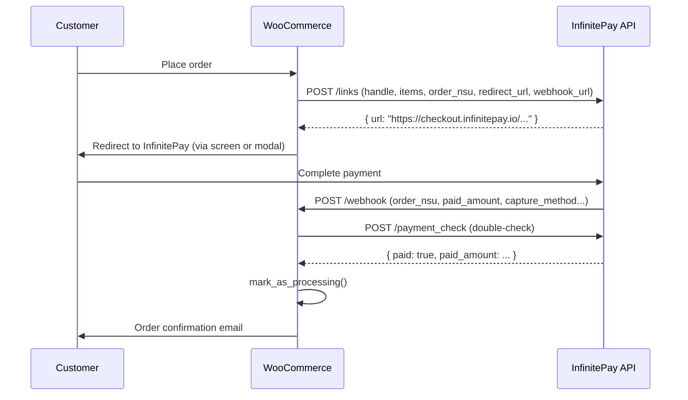

# Architecture

## Overview

This plugin integrates WooCommerce with InfinitePay's **Checkout Integrado** (Link Integrado) API.
Authentication uses only the merchant's **InfiniteTag** (handle) — no API key required.

## Directory Structure

```
infinitepay-woocommerce/
├── src/
│   ├── Api/                  # HTTP client + endpoint wrappers
│   ├── Admin/                # Settings fields + Status page
│   ├── Blocks/               # WooCommerce Blocks integration
│   ├── Checkout/             # Redirect screen + Modal handler
│   ├── Gateways/             # WC_Payment_Gateway implementations
│   ├── Order/                # HPOS-safe order helpers + meta keys
│   ├── PaymentRecovery/      # Cron, return handler, admin button
│   ├── Webhooks/             # REST route + payload validator
│   └── Logger.php            # WC logger wrapper with handle masking
├── assets/
│   ├── css/                  # redirect-screen.css, admin.css
│   ├── js/                   # redirect-screen.js, modal-handler.js, checkout-blocks.js
│   └── images/               # logos/icons
├── templates/checkout/       # Overridable PHP templates
├── i18n/languages/           # .po/.pot translation files
├── tests/Unit/               # PHPUnit test suites
└── infinitepay-woocommerce.php  # Plugin entry point
```

## Payment Flow



## Key Design Decisions

- **HPOS-compatible**: all order meta access via `$order->get_meta()` / `update_meta_data()`, never `get_post_meta()`
- **Idempotent webhook**: orders already in `processing`/`completed` return HTTP 200 without re-processing
- **Amount tolerance**: 1 cent tolerance on `paid_amount` vs `order total` to handle rounding
- **Handle masking**: Logger masks the InfiniteTag in all log entries (shows first 3 chars + `***`)
- **No card data**: the plugin never handles card numbers — InfinitePay's hosted checkout does
