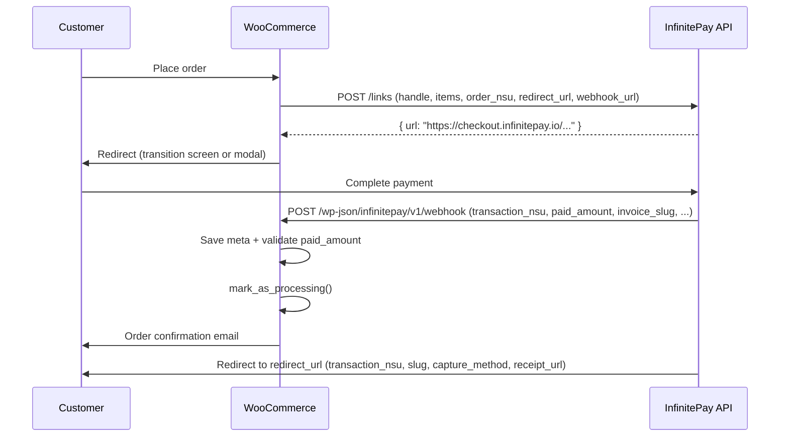
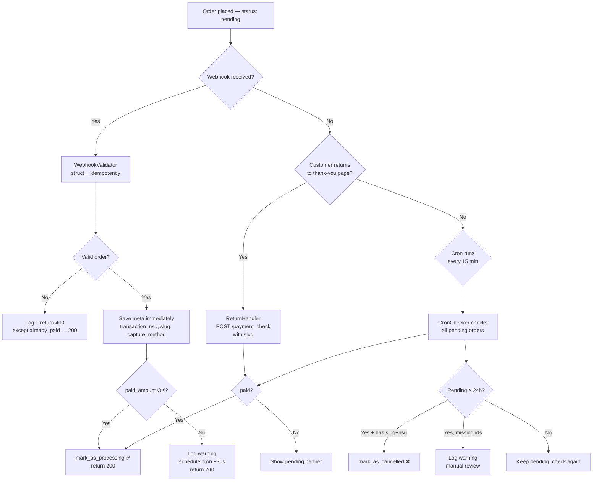
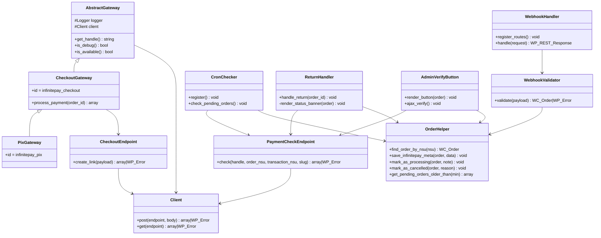

# Architecture

## Overview

This plugin integrates WooCommerce with InfinitePay's **Checkout Integrado** (Link Integrado) API.
Authentication uses only the merchant's **InfiniteTag** (handle) — no API key required.

---

## Directory Structure

```
infinitepay-woocommerce/
├── src/
│   ├── Api/                  # HTTP client + endpoint wrappers
│   │   ├── Client.php            wp_remote_post/get wrapper
│   │   ├── CheckoutEndpoint.php  POST /links
│   │   └── PaymentCheckEndpoint.php  POST /payment_check
│   ├── Admin/
│   │   ├── Settings.php          Redirect screen settings fields
│   │   └── StatusPage.php        WooCommerce system status report
│   ├── Blocks/
│   │   └── BlockSupport.php      WooCommerce Blocks integration
│   ├── Checkout/
│   │   ├── RedirectScreen.php    Renders transition screen
│   │   └── ModalHandler.php      Enqueues modal JS
│   ├── Gateways/
│   │   ├── AbstractGateway.php   Base WC_Payment_Gateway
│   │   ├── CheckoutGateway.php   infinitepay_checkout
│   │   └── PixGateway.php        infinitepay_pix
│   ├── Order/
│   │   ├── OrderMetaKeys.php     Meta key constants
│   │   └── OrderHelper.php       HPOS-safe order helpers
│   ├── PaymentRecovery/
│   │   ├── CronChecker.php       15-min cron job
│   │   ├── ReturnHandler.php     Thank-you page double-check + status banner
│   │   └── AdminVerifyButton.php Manual verify button in order screen
│   ├── Webhooks/
│   │   ├── WebhookHandler.php    REST POST /infinitepay/v1/webhook
│   │   └── WebhookValidator.php  Payload validation (structure + idempotency)
│   └── Logger.php                WC logger wrapper, masks handle
├── assets/
│   ├── css/redirect-screen.css
│   ├── css/admin.css
│   ├── js/redirect-screen.js
│   ├── js/modal-handler.js
│   └── js/checkout-blocks.js
├── templates/checkout/
│   └── redirect-screen.php       Overridable template
├── i18n/languages/               PT-BR translations
├── tests/Unit/                   PHPUnit test suites
└── infinitepay-woocommerce.php   Plugin entry point
```

---

## Identifiers

| Identifier | Created by | Example | Where it appears |
|---|---|---|---|
| WC Order ID | WooCommerce | `192` | WC order key |
| `order_nsu` | Plugin | `WC-192-1782528492` | `POST /links` body; saved to order meta; `WC-{id}-{unix_timestamp}` makes each payment attempt unique |
| `handle` | InfinitePay account | `lucas-souza-tdo` | InfiniteTag without `$`; identifies the merchant in every API call |
| `transaction_nsu` | InfinitePay | `e0bc15b7-3c30-4898-b33a-765a85e6b4b3` | Redirect query string + webhook payload (same value) |
| `slug` / `invoice_slug` | InfinitePay | `UMaS4Sotxo` | Invoice code — **name varies by surface** (see gotcha below) |

### ⚠️ slug vs invoice_slug — InfinitePay naming inconsistency

InfinitePay uses different field names for the same invoice code depending on the surface:

| Surface | Field name |
|---|---|
| Webhook payload | `invoice_slug` |
| Redirect query string | `slug` |
| `/payment_check` request body | `slug` |

The plugin stores it internally as `_infinitepay_invoice_slug` (meta key `INVOICE_SLUG`),
but sends it as `slug` in `/payment_check` requests. Sending `invoice_slug` returns `{"success":false}`.

### transaction_id vs transaction_nsu

InfinitePay sends **both** `transaction_id` and `transaction_nsu` in the redirect URL with
**identical values**. Only `transaction_nsu` is documented. The plugin ignores `transaction_id`.

---

## Payment Flow



---

## Payment Recovery Flow



---

## Class Diagram



---

## Key Design Decisions

- **HPOS-compatible** — todo acesso a meta via `$order->get_meta()` / `update_meta_data()`, nunca `get_post_meta()`
- **Idempotent webhook** — pedidos já em `processing`/`completed` retornam HTTP 200 sem reprocessar
- **Webhook sem back-call** — o WebhookValidator não consulta `/payment_check`; valida apenas estrutura, existência do pedido e idempotência. A verificação de valor é feita pelo WebhookHandler com o `paid_amount` do próprio payload
- **Meta salvo imediatamente no webhook** — `transaction_nsu`, `invoice_slug` e `capture_method` são persistidos antes de qualquer validação de valor, garantindo que o cron, botão e ReturnHandler sempre tenham os identificadores para consultar `/payment_check`
- **`/payment_check` exige os 4 campos** — `handle`, `order_nsu`, `transaction_nsu` e `slug` são todos obrigatórios; faltando qualquer um retorna `{"success":false}`. Ver `docs/PAYMENT-CHECK-CONTRACT.md`
- **Campo `slug` (não `invoice_slug`) no `/payment_check`** — a InfinitePay usa nomes diferentes por superfície. Validado empiricamente com pedido real
- **`transaction_id` ignorado** — alias não-documentado do `transaction_nsu` (mesmo UUID no redirect); apenas `transaction_nsu` é usado
- **`capture_method` persistido em todos os caminhos** — webhook, ReturnHandler, AdminVerifyButton e CronChecker salvam o método de captura (pix, credit_card...) para fins analíticos
- **Cancelamento por cron seguro** — só cancela após 24h se `transaction_nsu` + `slug` estiverem presentes (confirmação verificável); sem eles, mantém pendente e alerta para revisão manual
- **Amount tolerance** — tolerância de 1 centavo entre `paid_amount` e total do pedido (arredondamento)
- **Handle masking** — Logger mascara a InfiniteTag em todos os logs (mostra 3 chars + `***`)
- **No card data** — o plugin nunca manipula dados de cartão; o checkout hospedado da InfinitePay faz isso
- **Triple payment recovery** — webhook + ReturnHandler + cron garantem que nenhum pagamento fica sem confirmação
