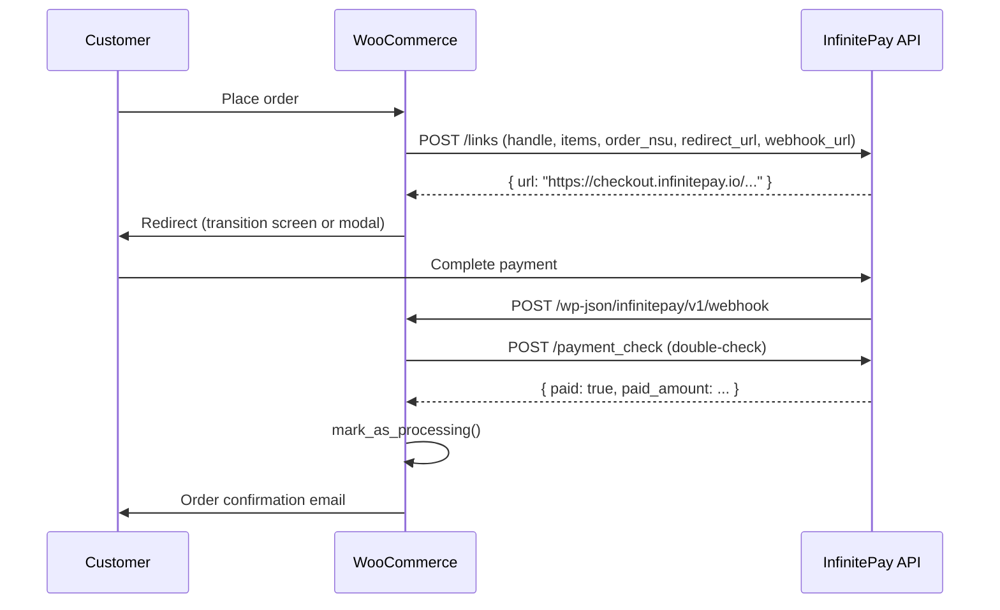
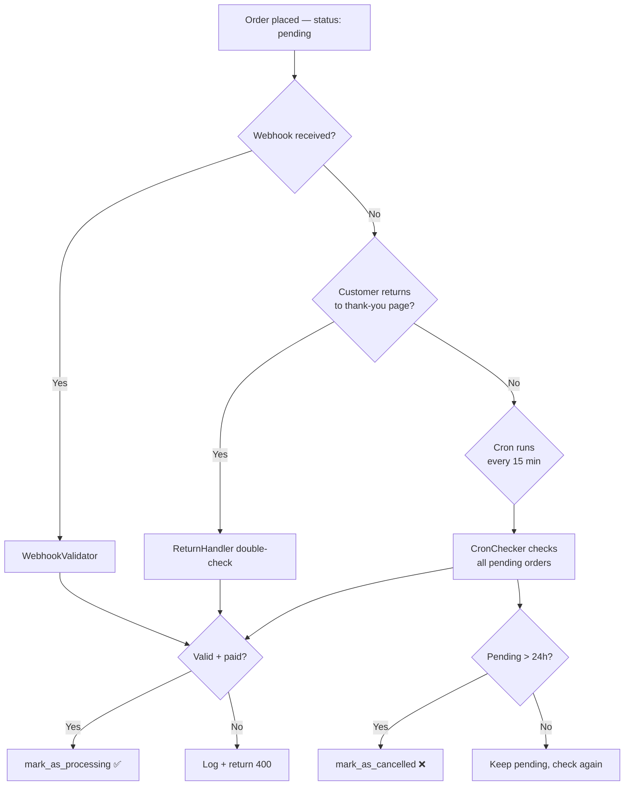
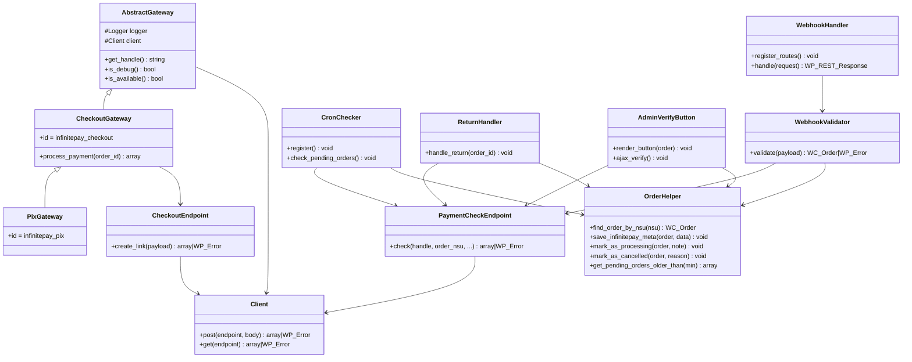

# Architecture

## Overview

This plugin integrates WooCommerce with InfinitePay's **Checkout Integrado** (Link Integrado) API.
Authentication uses only the merchant's **InfiniteTag** (handle) — no API key required.

---

## Directory Structure

```
infinitepay-woocommerce/
├── src/
│   ├── Api/                  # HTTP client + endpoint wrappers
│   │   ├── Client.php            wp_remote_post/get wrapper
│   │   ├── CheckoutEndpoint.php  POST /links
│   │   └── PaymentCheckEndpoint.php  POST /payment_check
│   ├── Admin/
│   │   ├── Settings.php          Redirect screen settings fields
│   │   └── StatusPage.php        WooCommerce system status report
│   ├── Blocks/
│   │   └── BlockSupport.php      WooCommerce Blocks integration
│   ├── Checkout/
│   │   ├── RedirectScreen.php    Renders transition screen
│   │   └── ModalHandler.php      Enqueues modal JS
│   ├── Gateways/
│   │   ├── AbstractGateway.php   Base WC_Payment_Gateway
│   │   ├── CheckoutGateway.php   infinitepay_checkout
│   │   └── PixGateway.php        infinitepay_pix
│   ├── Order/
│   │   ├── OrderMetaKeys.php     Meta key constants
│   │   └── OrderHelper.php       HPOS-safe order helpers
│   ├── PaymentRecovery/
│   │   ├── CronChecker.php       15-min cron job
│   │   ├── ReturnHandler.php     Thank-you page double-check
│   │   └── AdminVerifyButton.php Manual verify button in order screen
│   ├── Webhooks/
│   │   ├── WebhookHandler.php    REST POST /infinitepay/v1/webhook
│   │   └── WebhookValidator.php  Payload validation + amount check
│   └── Logger.php                WC logger wrapper, masks handle
├── assets/
│   ├── css/redirect-screen.css
│   ├── css/admin.css
│   ├── js/redirect-screen.js
│   ├── js/modal-handler.js
│   └── js/checkout-blocks.js
├── templates/checkout/
│   └── redirect-screen.php       Overridable template
├── i18n/languages/               PT-BR translations
├── tests/Unit/                   PHPUnit test suites
└── infinitepay-woocommerce.php   Plugin entry point
```

---

## Payment Flow



---

## Payment Recovery Flow



---

## Class Diagram



---

## Key Design Decisions

- **HPOS-compatible** — todo acesso a meta via `$order->get_meta()` / `update_meta_data()`, nunca `get_post_meta()`
- **Idempotent webhook** — pedidos já em `processing`/`completed` retornam HTTP 200 sem reprocessar
- **Amount tolerance** — tolerância de 1 centavo entre `paid_amount` e total do pedido (arredondamento)
- **Handle masking** — Logger mascara a InfiniteTag em todos os logs (mostra 3 chars + `***`)
- **No card data** — o plugin nunca manipula dados de cartão; o checkout hospedado da InfinitePay faz isso
- **Triple payment recovery** — webhook + return handler + cron garantem que nenhum pagamento fica sem confirmação
